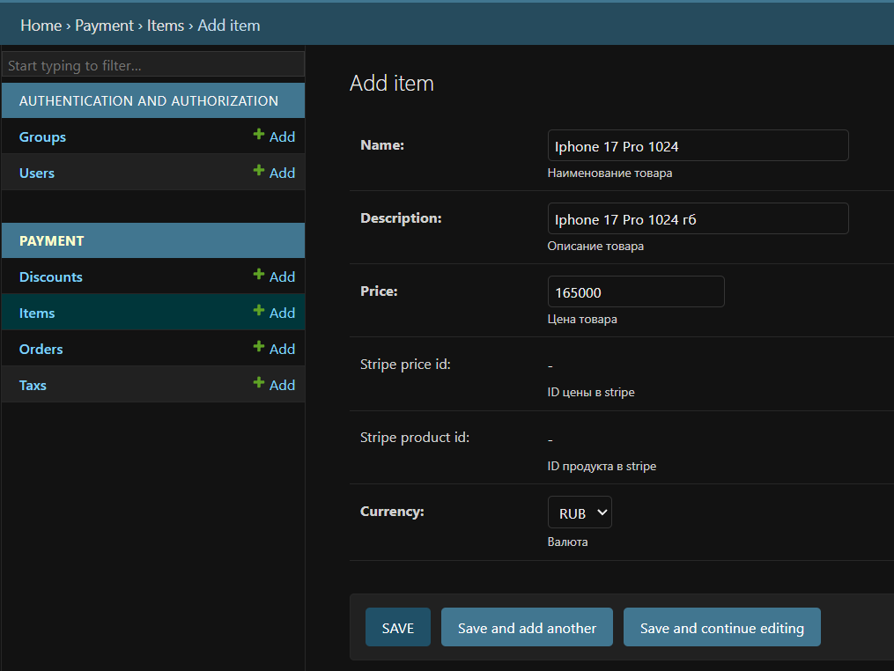
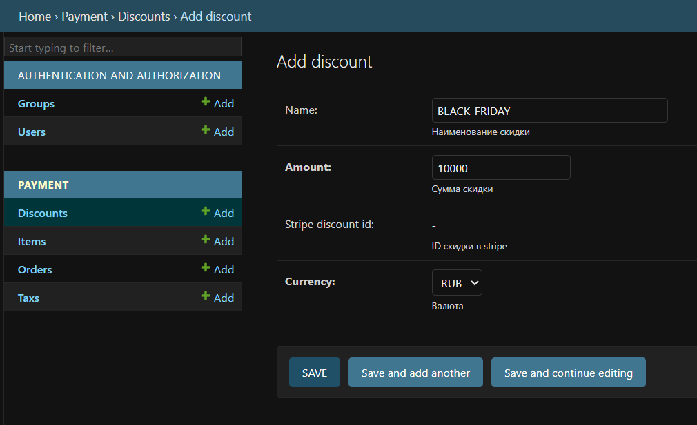
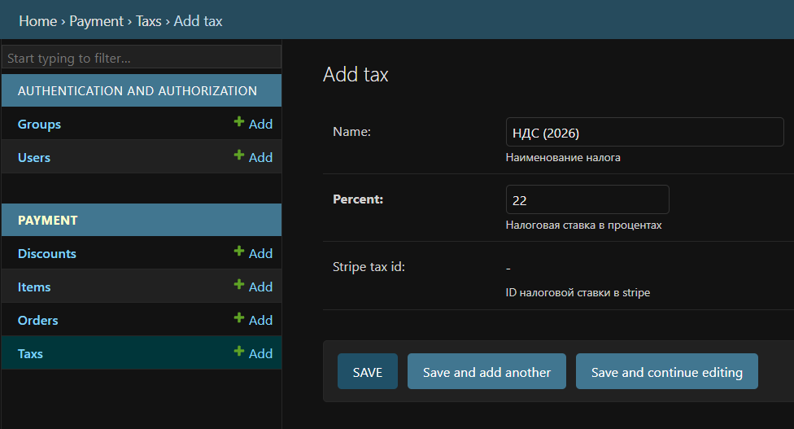

# Django Payment App (with Stripe)

Небольшое Django-приложение реализует бэкенд на **Django + Stripe API** с оплатой отдельных товаров и заказов, поддержкой скидок, налогов, мультивалютности, работу с Djando anmin и запуском через Docker.

---

## Содержание

- [1. Запуск проекта](#1-запуск-проекта)
  - [1.1. Продакшн-версия](#11-продакшн-версия)
  - [1.2. Запуск через Docker](#12-запуск-через-docker)
  - [1.3. Запуск проекта локально (без Docker)](#13-запуск-проекта-локально-без-docker)
- [Работа с django admin](#2-работа-с-django-admin)
  - [Создание Item](#21-создание-item)
  - [Создание Discount](#22-создание-discount)
  - [Создание Tax](#23-создание-tax)
  - [Создание Order](#24-создание-order)
- [3. Модели](#3-модели)
  - [3.1. Модель Item](#31-модель-item)
  - [3.2. Модель Discount](#32-модель-discount)
  - [3.3. Модель Tax](#33-модель-tax)
  - [3.4. Модель Order](#34-модель-order)
  - [3.5. Модель OrderItem](#34-модель-order)
- [4. Функциональность](#4-функциональность)
  - [4.1. Оплата товара](#41-оплата-товара)
  - [4.2. Оплата заказа](#42-оплата-заказа)
  - [4.3. Заполнение "stripe" атрибутов в базе данных](#43-заполнение-stripe-атрибутов-в-базе-данных)
  - [4.4. Успешная оплата заказа](#44-успешная-оплата-заказа)
  - [4.5. Логирование](#45-логирование)
- [5. Внешний вид](#5-внешний-вид)
- [6. Автор](#6-автор)

---

## 1. Запуск проекта

### 1.1. Продакшн-версия

#### 1.1.1. Адрес

https://payment-8pnz.onrender.com/

#### 1.1.2. Админка Django:

https://payment-8pnz.onrender.com/admin/

Логин/пароль администратора:

> login: `root`  
> password: `root1234`

---

### 1.2. Запуск через Docker

#### 1.2.1. Собрать образ

```bash
docker build -t payment-app .
```

#### 1.2.2. Создать .env

Все чувствительные настройки вынесены в переменные окружения (.env):

Пример .env (создать файл локально, в корне проекта):

```bash
SECRET_KEY=(ключ джанго-приложения из settings.py)
PUBLISHABLE_KEY_STRIPE=(pk_test_... API ключ из личного кабинета stripe)
SECRET_KEY_STRIPE=(sk_test_... API ключ из личного кабинета stripe)
WEBHOOK_KEY_STRIPE=(whsec_... API ключ webhooks stripe)
DEBUG=True
DJANGO_SUPERUSER_USERNAME=root
DJANGO_SUPERUSER_EMAIL=root@example.com
DJANGO_SUPERUSER_PASSWORD=root1234
```


#### 1.2.3. Запуск контейнера

```bash
docker run -p 8000:8000 --env-file .env payment-app
```

Приложение будет доступно по адресу:  
**http://127.0.0.1:8000/** или **http://localhost:8000/**

Админка будет доступна по адресу:  
**http://localhost:8000/admin/**


---

### 1.3. Запуск проекта локально (без Docker)

#### 1.3.1. Клонировать репозиторий
```bash
git clone https://github.com/DashaOdnostorontseva/payment
cd payment
```

#### 1.3.2. Создать и активировать виртуальное окружение
Для Linux/macOS:
```bash
python -m venv venv
source venv/bin/activate
```
Для Windows:
```bash
venv\Scripts\activate
```

#### 1.3.3. Установить зависимости
```bash
pip install -r requirements.txt
```

#### 1.3.4. Создать .env
Все чувствительные настройки вынесены в переменные окружения (.env):

Пример .env (создать файл локально, в корне проекта):

```bash
SECRET_KEY=(ключ джанго-приложения из settings.py)
PUBLISHABLE_KEY_STRIPE=(pk_test_... API ключ из личного кабинета stripe)
SECRET_KEY_STRIPE=(sk_test_... API ключ из личного кабинета stripe)
WEBHOOK_KEY_STRIPE=(whsec_... API ключ webhooks stripe)
DEBUG=True
DJANGO_SUPERUSER_USERNAME=root
DJANGO_SUPERUSER_EMAIL=root@example.com
DJANGO_SUPERUSER_PASSWORD=root1234
```

#### 1.3.5. Применить миграции и собрать статику
```bash
python manage.py migrate
python manage.py collectstatic --noinput
```

#### 1.3.6. Загрузить тестовые данные
```bash
python manage.py loaddata payment/fixtures/initial_data.json
```

#### 1.3.7. Создать суперпользователя
```bash
python manage.py createsuperuser
```
Далее следуйте стандартным вопросам Django: укажите логин, email (можно любой) и пароль.

#### 1.3.8. Запустить сервер разработки
```bash
python manage.py runserver
```

Приложение будет доступно по адресу:  
**http://127.0.0.1:8000/** или **http://localhost:8000/**

Админка будет доступна по адресу:  
**http://localhost:8000/admin/**

---

## 2. Работа с django admin

### 2.1. Создание Item

- Зайти в админку
- Перейти в раздел **Payment → Items**.
- Нажать **Add item**.
- Заполнить поля:
    - `name` - Наименование товара  
    - `description` - Описание товара  
    - `price` - Цена товара  
    - `currency` - Выбрать валюту, в которой будет оплачиваться товар (`rub`, `eur`) 
- Нажать **Save**.

Пример заполнения полей при создании нового Item в django admin:



---

### 2.2. Создание Discount

- Зайти в админку
- Перейти в раздел **Payment → Discounts**.
- Нажать **Add discount**.
- Заполнить поля:
    - `name` - Наименование скидки
    - `description` - Сумма скидки 
    - `currency` - Выбрать валюту, в которой будет предоставлена скидка (`rub`, `eur`) 
- Нажать **Save**.

Пример заполнения полей при создании нового Discount в django admin:



---

### 2.3. Создание Tax

- Зайти в админку
- Перейти в раздел **Payment → Taxs**.
- Нажать **Add tax**.
- Заполнить поля:
    - `name` - Наименование налога
    - `percent` - Налоговая ставка в процентах
- Нажать **Save**.

Пример заполнения полей при создании нового Tax в django admin:



---

### 2.4. Создание Order

- Зайти в админку
- Перейти в раздел **Payment → Orders**.
- Нажать **Add order**.
- Заполнить поля:
    - `discount` - Выбрать скидку, которая будет применена к данному заказу
    - `tax` - Выбрать налог, который будет применен к данному заказу
    - `ORDERED ITEMS` - Добавить Items, которые составляют заказ, а также указать их количество

- Нажать **Save**.

Пример заполнения полей при создании нового Order в django admin:


---

## 3. Модели

### 3.1. Модель `Item`

- `name` - Наименование товара  
- `description` - Описание товара  
- `price` - Цена товара  
- `currency` - Валюта, в которой продается товар (`rub`, `eur`) 

- `stripe_product_id` - ID продукта в stripe
- `stripe_price_id` - ID цены в stripe

---

### 3.2. Модель `Discount`

- `name` - Наименование скидки
- `amount` - Сумма скидки
- `stripe_discount_id` - ID скидки (купона) в stripe

- `currency` - Валюта, в которой предоставляется скидка (`rub`, `eur`) 

---

### 3.3. Модель `Tax`

- `name` - Наименование налога
- `percent` - Налоговая ставка в процентах
- `stripe_tax_id` - ID налоговой ставки в stripe

---

### 3.4. Модель `Order`

- `created_at` - Дата и время создания заказа
- `paid` - Флаг «Заказ оплачен»
- `stripe_session_id` - ID сессии в stripe
- `total_amount` - Сумма заказа
- `discount` - Cсылка на модель скидки (Размер скидки)
- `tax` - Cсылка на модель налога (Налоговая ставка)

---

### 3.5. Модель `OrderItem`

- `order` - Cсылка на модель заказа
- `item` - Cсылка на модель товара
- `quantity` - Количество товаров

---

## 4. Функциональность

### 4.1. Оплата товара

#### Вариант 1.
- Ввести на главной странице ID товара (например, 1) и нажать кнопку "Посмотреть товар";
- После успешной переадресации нажать кнопку "Оплатить товар";
- JS делает GET запрос на /pay_item/{id};
- Бэкенд создаёт Stripe Checkout Session и возвращает sessionUrl;
- Пользователь попадает на Stripe Checkout страницу и совершает оплату.

#### Вариант 2.
- Перейти на адрес: https://payment-8pnz.onrender.com/item/1;
- Нажать кнопку "Оплатить товар";
- JS делает GET запрос на /pay_item/{id};
- Бэкенд создаёт Stripe Checkout Session и возвращает sessionUrl;
- Пользователь попадает на Stripe Checkout страницу и совершает оплату.

#### Вариант 3.
- Используя командную строку: curl -X GET https://payment-8pnz.onrender.com/pay_item/1;
- Получить sessionId, перейти по нему;
- При открытии Stripe Checkout страницы совершить оплату.

---

### 4.2. Оплата заказа

#### Вариант 1.
- Ввести на главной странице ID заказа (например, 3) и нажать кнопку "Посмотреть заказ";
- После успешной переадресации нажать кнопку "Оплатить заказ";
- JS делает GET запрос на /pay_order/{id};
- Бэкенд создаёт Stripe Checkout Session и возвращает sessionUrl;
- Пользователь попадает на Stripe Checkout страницу и совершает оплату.

---

#### Вариант 2.
- Перейти на адрес: https://payment-8pnz.onrender.com/order/3;
- Нажать кнопку "Купить";
- JS делает GET запрос на /pay_order/{id};
- Бэкенд создаёт Stripe Checkout Session и возвращает sessionUrl;
- Пользователь попадает на Stripe Checkout страницу и совершает оплату.

---

#### Вариант 3.
- Используя командную строку: curl -X GET https://payment-8pnz.onrender.com/pay_order/3;
- Получить sessionId, перейти по нему;
- При открытии Stripe Checkout страницы совершить оплату.

---

### 4.3. Заполнение "stripe" атрибутов в базе данных

При первой попытке оплаты товара или заказа для объектов в базе автоматически создаются соответствующие сущности в Stripe, а их идентификаторы сохраняются в моделях:
  - у `Item` - `stripe_product_id` и `stripe_price_id` (привязка товара к Product и Price в Stripe);
  - у `Discount` - `stripe_discount_id` (купон в Stripe);
  - у `Tax` - `stripe_tax_id` (налоговая ставка в Stripe).
  - у `Order` - `stripe_session_id` (ID Checkout Session в Stripe, по которому затем обрабатывается вебхук);
  
Это позволяет отслеживать явную связь между локальными моделями и объектами Stripe.

---

### 4.4. Успешная оплата заказа

Реализован эндпоинт:
```
POST /stripe/webhook/
```
После успешной оплаты Stripe отправляет вебхук на /stripe/webhook/, а обработчик отмечает Order.paid = True. Подробнее:
  - при переходе на оплату создаётся Stripe Checkout Session, её `id` сохраняется в поле `stripe_session_id` у `Order`;
  - после успешной оплаты Stripe отправляет webhook (`checkout.session.completed` или `checkout.session.expired`) на эндпоинт;
  - обработчик вебхука по `session.id` находит соответствующий `Order` и выставляет флаг `paid = True`. Таким образом, статус заказа в базе данных синхронизирован с фактическим статусом оплаты в Stripe.

---

### 4.5. Логирование

В проекте используется стандартный модуль `logging`. Логируются, в частности:
  - обращения к основным view (`item`, `pay_item`, `pay_order` и др.);
  - попытки оплаты и создание Stripe Session;
  - обращение к Stripe для создания объектов (сессии, заказы, цены и др.)
  - входящие webhook-запросы от Stripe и результат их обработки.  

---

## 5. Внешний вид

Внешний вид приложения оформлен через стандарный CSS: `static/css/styles.css`

---

## 6. Автор

**Автор:** *Дарья Односторонцева / telegram: @dariacross*  

---


